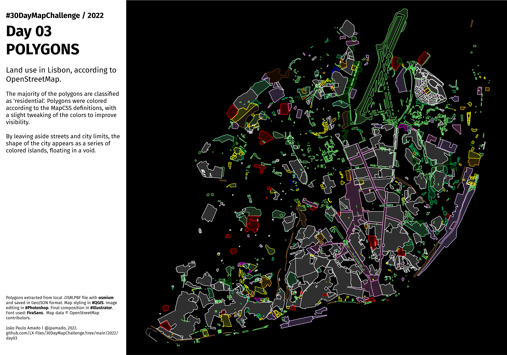

<h1>MAP for day 3 - POLYGONS</h1>
<h2>LANDUSE IN LISBON, ACCORDING TO OPENSTREETMAP.</h2>

The majority of the polygons are classified as 'residential'. Polygons were colored according to the MapCSS definitions, with a slight tweaking of the colors to improve visibility.

By leaving aside streets and city limits, the shape of the city appears as a series of colored islands, floating in a void.

Polygons extracted from local .OSM.PBF file with osmium and saved in GeoJSON format. Map styling in #QGIS. Image editing in #Photoshop. Final composition in #Illustrator. Font used: FiraSans.  Map data © OpenStreetMap contributors

File listing:

<ul>
  <li><b>30daymapchallenge__2022-day-03__polygons.png</b> - the MAP itself.</li>
  <li><b>30daymapchallenge__2022-day-03__polygons.qgz</b> - QGIS project file.</li>
  <li><b>landuse_lx_municipality.geojson</b> - GeoJSON file with all the polygons drawn.</li>
  </ul>

João Paulo Amado | @jpamado, 2022.

&nbsp;

<table>
<tr>
<td style="border:thin #000">

</td>
</tr>
</table>
