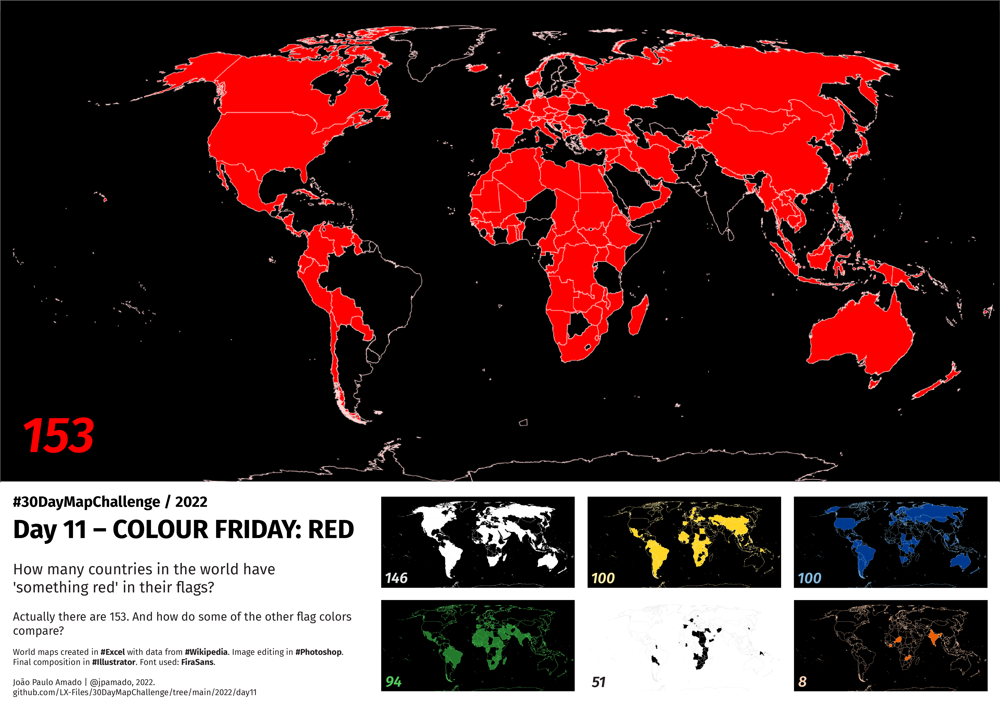

<h1>MAP for day 11 - COLOUR FRIDAY: RED</h1>
<h2>HOW MANY COUNTRIES IN THE WORLD HAVE 'SOMETHING RED' IN THEIR FLAGS?</h2>

Actually there are 153. And how do some other flag colours compare? This is not a true exercise in vexilology, but only a way to quickly relate the colour 'red' with others. Also, I took some liberties regarding colour tones and so on, counting together white and silver, or yellow and gold, as well as merging several different tones of green or blue.

Sorry if I misrepresent any country.

World maps created in #Excel with data from #Wikipedia. Image editing in #Photoshop. Final composition in #Illustrator. Font used: FiraSans.

File listing:

<ul>
  <li><b>30daymapchallenge__2022-day-11__red.png</b> - the MAP itself.</li>
  <li><b>flag_colour_count.xlsx</b> - Excel file with values and base map.</li>
</ul>

Data extracted mostly from this Wikipedia page: <a href="https://en.wikipedia.org/wiki/List_of_sovereign_states">List of sovereign states</a>

João Paulo Amado | @jpamado, 2022.

&nbsp;

<table>
<tr>
<td style="border:thin #000">

</td>
</tr>
</table>
