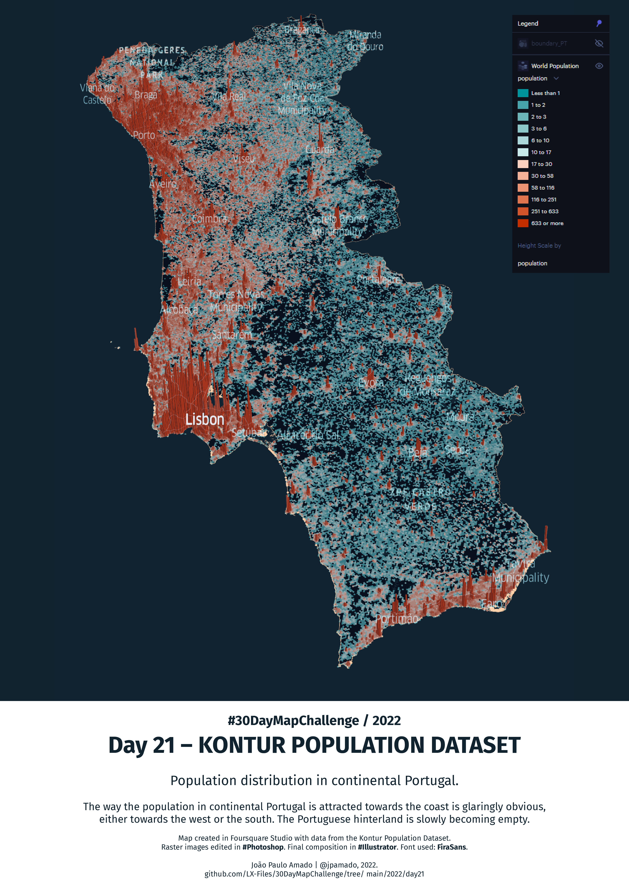

<h1>MAP for day 21 - KONTUR POPULATION DATASET</h1>
<h2>POPULATION DISTRIBUTION IN CONTINENTAL PORTUGAL</h2>

The way the population in continental Portugal is attracted towards the coast is glaringly obvious, either towards west or south. The portuguese hinterland is slowly becoming empty.

Map created in Foursquare Studio with data from the Kontur Population Dataset. Raster images edited in #Photoshop. Final composition in #Illustrator. Font used: FiraSans.

File listing:

<ul>
  <li><b>30daymapchallenge__2022-day-21__kontur.png</b> - the MAP itself.</li>
  <li><b>boundary_PT.geojson</b> - the contour for Portugal, in geoJSON format.</li>
  </ul>

João Paulo Amado | @jpamado, 2022.

&nbsp;

<table>
<tr>
<td style="border:thin #000">

</td>
</tr>
</table>
