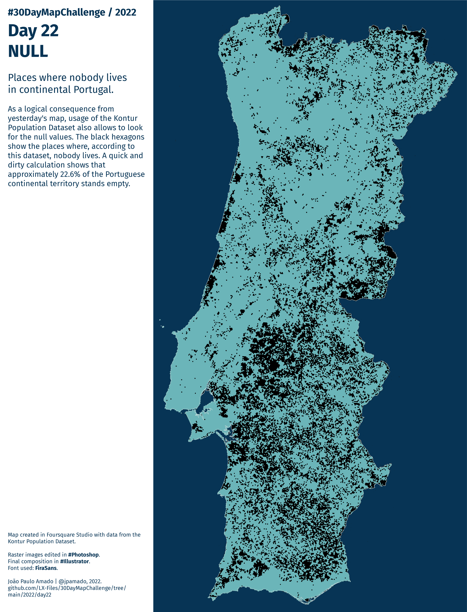

<h1>MAP for day 22 - NULL</h1>
<h2>Places where nobody lives in continental Portugal.</h2>

As a logical consequence from yesterday's map, usage of the Kontur Population Dataset also allows to look for the null values. The black hexagons show the places where, according to this dataset, nobody lives. A quick and dirty calculation shows that approximately 22.6% of the Portuguese continental territory stands empty.

Map created in Foursquare Studio with data from the Kontur Population Dataset. Raster image edited in #Photoshop. Final composition in #Illustrator. Font used: FiraSans.

File listing:

<ul>
  <li><b>30daymapchallenge__2022-day-22__null.png</b> - the MAP itself.</li>
  <li><b>boundary_PT.geojson</b> - the contour for Portugal, in geoJSON format.</li>
  </ul>

João Paulo Amado | @jpamado, 2022.

&nbsp;

<table>
<tr>
<td style="border:thin #000">

</td>
</tr>
</table>
