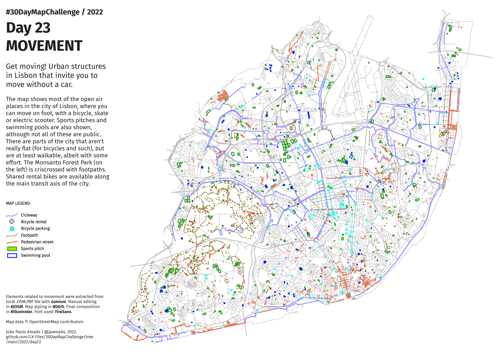

<h1>MAP for day 23 - MOVEMENT</h1>
<h2>Get moving! Urban structures in Lisbon that invite you to move without a car.</h2>

The map shows most of the open air places in the city of Lisbon, where you can move on foot, with a bicycle, skate or electric scooter.
Sports pitches and swimming pools are also shown, although not all of these are public. There are parts of the city that aren't really 
flat (for bicycles and such), but are at least walkable, albeit with some effort. The Monsanto Forest Park (on the left) is criscrossed 
with footpaths. Shared rental bikes are available along the main transit axis of the city. 

Elements related to movement were extracted from local .OSM.PBF file with osmium. Manual editing in #JOSM. Map styling in #QGIS. 
Final composition in #Illustrator. Font used: FiraSans.

Map data © OpenStreetMap contributors.

File listing:

<ul>
  <li><b>30daymapchallenge__2022-day-23__movement.png</b> - the MAP itself.</li>
  <li><b>lx_municipality_contour.gpx</b> - the contour line for the Lisbon municipality in 2022.</li>
  <li><b>movement__cycleway.geojson</b> - cycleways in GeoJSON format.</li>
  <li><b>movement__bicycle_rental.geojson</b> - bicycle rental spots in GeoJSON format.</li>
  <li><b>movement__bicycle_parking.geojson</b> - bicycle parking spots in GeoJSON format.</li>
  <li><b>movement__path.geojson</b> - footpaths in GeoJSON format.</li>
  <li><b>movement__pedestrian.geojson</b> - pedestrian streets in GeoJSON format.</li>
  <li><b>movement__pitch.geojson</b> - sports pitches in GeoJSON format.</li>
  <li><b>movement__swimming_pool.geojson</b> - swimming pools in GeoJSON format.</li>
  </ul>

João Paulo Amado | @jpamado, 2022.

&nbsp;

<table>
<tr>
<td style="border:thin #000">

</td>
</tr>
</table>
