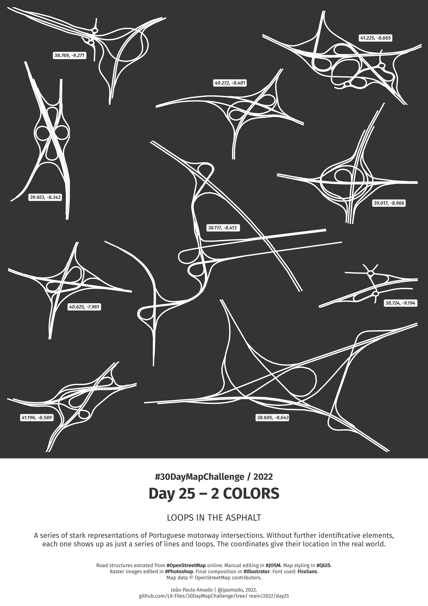

<h1>MAP for day 25 - 2 COLORS</h1>
<h2>LOOPS IN THE ASPHALT</h2>

A series of stark representations of Portuguese motorway intersections. Without further identificative elements, each one shows up
as just a series of lines and loops. The coordinates give their location in the real world.

Road structures extrated from #OpenStreetMap online. Manual editing in #JOSM. Map styling in #QGIS. Rasters edited in #Photoshop. Final composition in #Illustrator. Font used: FiraSans.

Map data © OpenStreetMap contributors.

File listing:

<ul>
  <li><b>30daymapchallenge__2022-day-25__2-colors.png</b> - the MAP itself.</li>
  <li><b>A1-A10.geojson</b> - intersection between the A1 and A10 motorways.</li>
  <li><b>A1-A14.geojson</b> - intersection between the A1 and A14 motorways.</li>
  <li><b>A2-A26-EN259-IC1.geojson</b> - intersection between the A2 and A26 motorways, and the EN259 and IC1 highways.</li>
  <li><b>A3-A4.geojson</b> - intersection between the A3 and A4 motorways.</li>
  <li><b>A5-4caminhos.geojson</b> - intersection between the A5 and a couple of smaller local roads.</li>
  <li><b>A13-A6-A2.geojson</b> - intersection between the A13, A6 and A2 motorways.</li>
  <li><b>A13-IC8.geojson</b> - intersection between the A13 motorway and the IC8 highway.</li>
  <li><b>A16-A9.geojson</b> - intersection between the A16 and A9 motorways.</li>
  <li><b>A24-A25.geojson</b> - intersection between the A24 and A25 motorways.</li>
  <li><b>A41-VRI.geojson</b> - intersection between the A41 motorway and the VRI highway.</li>
  </ul>

João Paulo Amado | @jpamado, 2022.

&nbsp;

<table>
<tr>
<td style="border:thin #000">

</td>
</tr>
</table>
