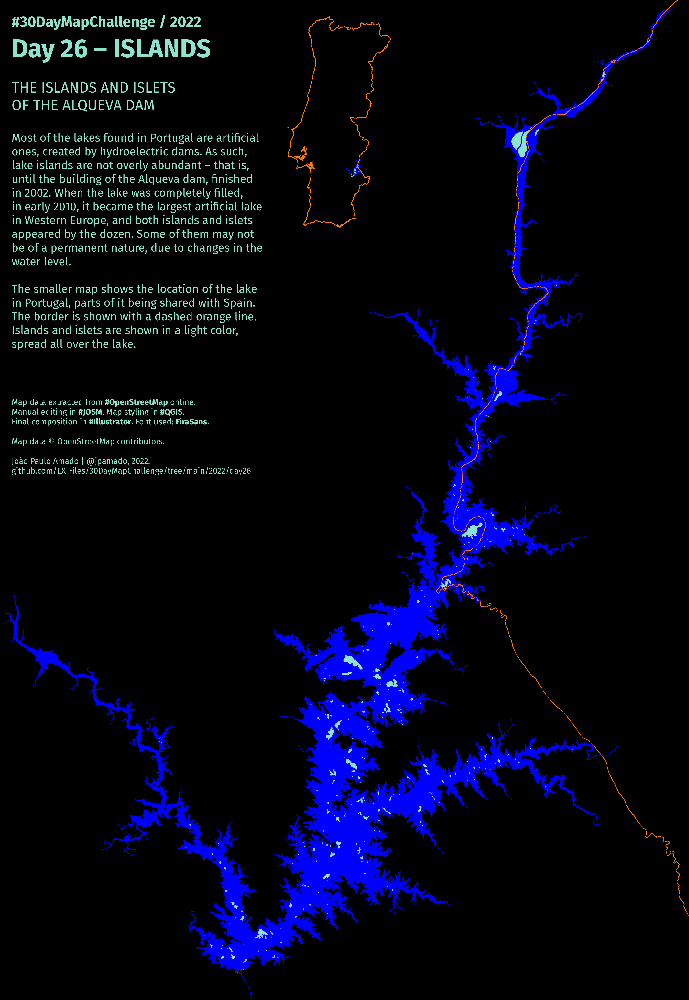

<h1>MAP for day 26 - ISLANDS</h1>
<h2>THE ISLANDS AND ISLETS OF THE ALQUEVA DAM</h2>

Most of the lakes found in Portugal are artificial ones, created by hydroelectric dams. As such, lake islands are not overly abundant - that is, until the building of the Alqueva dam, finished in 2002. When the lake was completely filled, in early 2010, it became the largest artificial lake in Western Europe - and both islands and islets appeared by the dozen. Some of them may not be of a permanent nature, due to changes in the water level.

The smaller map shows the location of the lake in Portugal, parts of it being shared with Spain. The border is shown with
a dashed orange line.

Map data extracted from #OpenStreetMap online. Manual editing in #JOSM. Map styling in #QGIS. Rasters edited in #Photoshop. Final composition in #Illustrator. Font used: FiraSans.

Map data © OpenStreetMap contributors.

File listing:

<ul>
  <li><b>30daymapchallenge__2022-day-26__islands.png</b> - the MAP itself.</li>
  <li><b>alqueva_lake.geojson</b> - the shape of the artificial lake in GeoJSON format.</li>
  <li><b>alqueva_islands_and_islets.geojson</b> - island and islets inside the lake in GeoJSON format.</li>
  <li><b>alqueva_waterways.geojson</b> - waterways feeding the lake in GeoJSON format.</li>
  <li><b>alqueva_dam.geojson</b> - the hydroelectric power station in GeoJSON format.</li>
  <li><b>alqueva_border.geojson</b> - the international border ith Spain in GeoJSON format.</li>
  </ul>

João Paulo Amado | @jpamado, 2022.

&nbsp;

<table>
<tr>
<td style="border:thin #000">

</td>
</tr>
</table>
