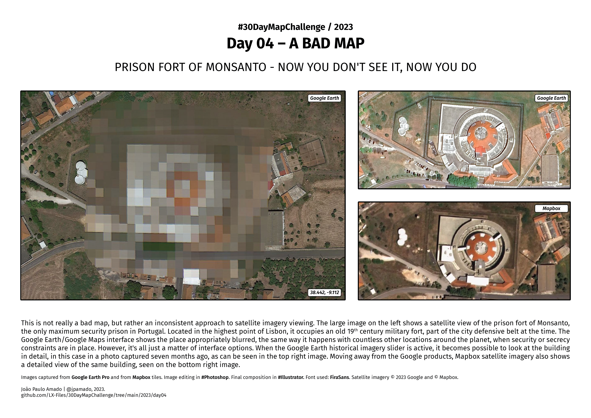

<h1>MAP for day 4 - A BAD MAP</h1>
<h2>PRISON FORT OF MONSANTO - NOW YOU DON'T SEE IT, NOW YOU DO</h2> 

This is not really a bad map, but rather an inconsistent approach to satellite imagery viewing. The large image on the left shows a satellite view of the prision fort of Monsanto, the only maximum security prision in Portugal. Located in the highest point of Lisbon, it occupies an old 19th century military fort, part of the city defensive belt at the time. The Google Earth/Google Maps interface shows the place appropriately blurred, the same way it happens with countless other locations around the planet, when security or secrecy constraints are in place. However, it's all just a matter of interface options. When the Google Earth historical imagery slider is active, it becomes possible to look at the building in detail, in this case in a photo captured seven months ago, as can be seen in the top right image. Moving away from the Google products, Mapbox satellite imagery also shows a detailed view of the same building, seen on the bottom right image.

Images captured from <b>Google Earth Pro</b> and from <b>Mapbox</b> tiles. Image editing in <b>Photoshop</b>. Final composition in <b>Illustrator</b>. Font used: <b>FiraSans</b>. Satellite imagery © 2023 Google and © Mapbox. 

File listing:

<ul>
<li><b>30daymapchallenge__2023-day04__a_bad_map.png</b> - the MAP itself.</li>
<li><b>prision_fort_of_monsanto.kml</b> - Google Maps placemark for the Prision fort of Monsanto.</li>
</ul>

&nbsp;

João Paulo Amado | @jpamado, 2023.

<table>
<tr>
<td style="border:thin #000">

</td>
</tr>
</table>
