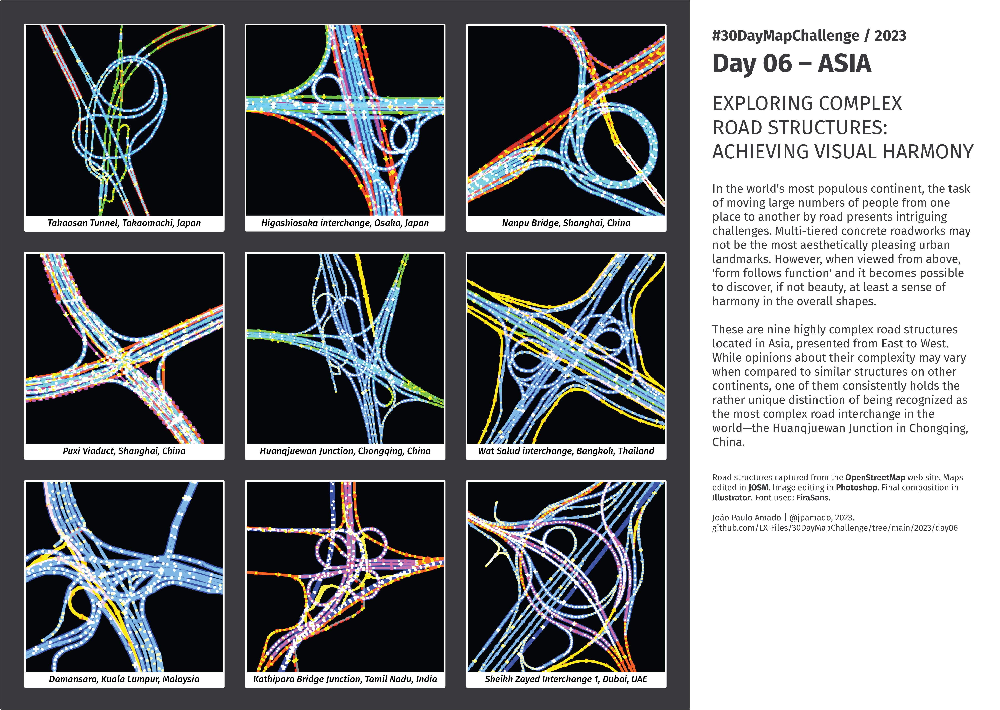

<h1>MAP for day 6 - ASIA</h1>
<h2>EXPLORING COMPLEX ROAD STRUCTURES: ACHIEVING VISUAL HARMONY</h2> 

In the world's most populous continent, the task of moving large numbers of people from one place to another by road presents intriguing challenges. Multi-tiered concrete roadworks may not be the most aesthetically pleasing urban landmarks. However, when viewed from above, 'form follows function' and it becomes possible to discover, if not beauty, at least a sense of harmony in the overall shapes.

These are nine highly complex road structures located in Asia, presented from East to West. While opinions about their complexity may vary when compared to similar structures on other continents, one of them consistently holds the rather unique distinction of being recognized as the most complex road interchange in the world—the Huanqjuewan Junction in Chongqing, China.

Road structures captured from the <b>OpenStreetMap</b> web site. Maps edited in <b>JOSM</b>. Image editing in <b>Photoshop</b>. Final composition in <b>Illustrator</b>. Font used: <b>FiraSans</b>.  

File listing:

<ul>
<li><b>30daymapchallenge__2023-day06__asia.png</b> - the MAP itself.</li>
<li><b>1-takaosan_tunnel.kml</b> - Google Earth placemark for the Takaosan Tunnel, Takaomachi, Japan</li> 
<li><b>2-higashiosaka_interchange.kml</b> - Google Earth placemark for the Higashiosaka interchange, Osaka, Japan</li>
<li><b>3-nanpu_bridge.kml</b> - Google Earth placemark for the Nanpu Bridge, Shanghai, China</li>
<li><b>4-puxi_viaduct.kml</b> - Google Earth placemark for the Puxi Viaduct, Shanghai, China</li>
<li><b>5-huanqjuewan_junction.kml</b> - Google Earth placemark for the Huanqjuewan Junction, Chongqing, China</li>
<li><b>6-wat_salud_interchange.kml</b> - Google Earth placemark for the Wat Salud interchange, Bangkok, Thailand</li>
<li><b>7-damansara.kml</b> - Google Earth placemark for the Damansara, Kuala Lumpur, Malaysia</li>
<li><b>8-kathipara_bridge_junction.kml</b> - Google Earth placemark for the Kathipara Bridge Junction, Tamil Nadu, India</li>
<li><b>9-sheikh_zayed_interchange_1.kml</b> - Google Earth placemark for the Sheikh Zayed Interchange 1, Dubai, UAE</li>

</ul>

&nbsp;

João Paulo Amado | @jpamado, 2023.

<table>
<tr>
<td style="border:thin #000">

</td>
</tr>
</table>
