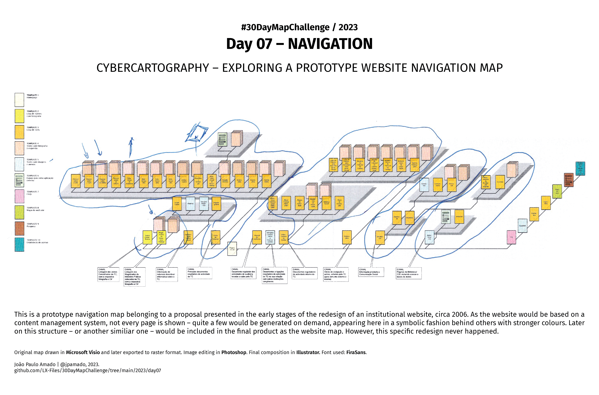

<h1>MAP for day 7 - NAVIGATION</h1>
<h2>CYBERCARTOGRAPHY - EXPLORING A PROTOTYPE WEBSITE NAVIGATION MAP</h2> 

This is a prototype navigation map belonging to a proposal presented in the early stages of the redesign of an institutional website, circa 2006. As the web site would be based on a content management system, not every page is shown - quite a few would be generated on demand, appearing here in a symbolic fashion behind others with stronger colours. Later on this structure - or another similiar one - would be included in the final product as the website map. However, this specific redesign never happened.

Original map drawn in <b>Microsoft Visio</b> and later exported to raster format. Image editing in <b>Photoshop</b>. Final composition in <b>Illustrator</b>. Font used: <b>FiraSans</b>.  

File listing:

<ul>
<li><b>30daymapchallenge__2023-day07__navigation.png</b> - the MAP itself.</li>
</ul>

&nbsp;

João Paulo Amado | @jpamado, 2023.

<table>
<tr>
<td style="border:thin #000">

</td>
</tr>
</table>
