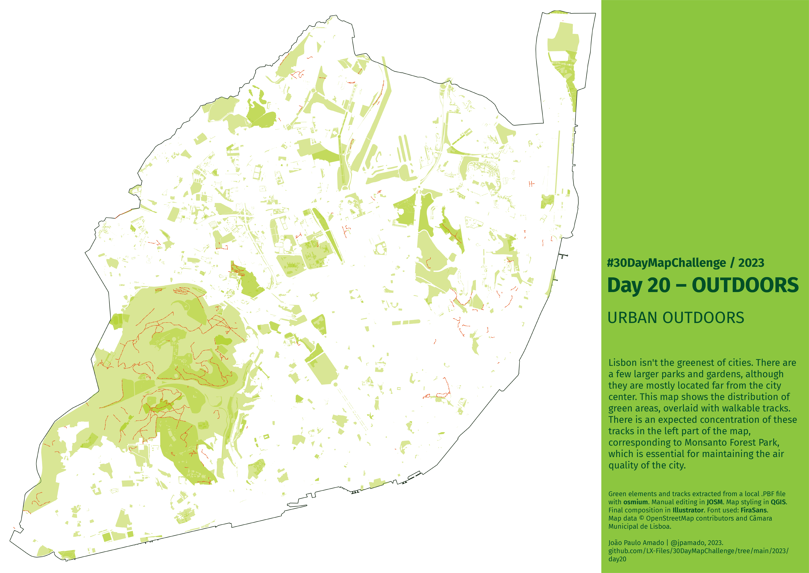

<h1>MAP for day 20 - OUTDOORS</h1>
<h2>URBAN OUTDOORS</h2> 

Lisbon isn't the greenest of cities. There are a few larger parks and gardens, although they are mostly located far from the city center. This map shows the distribution of green areas, overlaid with walkable tracks. There is an expected concentration of these tracks in the left part of the map, corresponding to Monsanto Forest Park, which is essential for maintaining the air quality of the city.

Green elements extracted from local .PBF file with <b>osmium</b>. Manual editing in </b>JOSM</b>. Map styling in <b>QGIS</b>. Final composition in <b>Illustrator</b>. Font used: <b>FiraSans</b>.  Map data &copy; OpenStreetMap contributors.

File listing:

<ul>
  <li><b>30daymapchallenge__2023-day20__outdoors.png</b> - the MAP itself.</li>
  <li><b>big_parks_and_gardens.geojson</b> - big parks and gardens, from the OpenStreetMap database.</li>
  <li><b>green_areas.geojson</b> - green areas, from the OpenStreetMap database.</li>
  <li><b>lisbon__highway_tracks.osm</b> - highway vectors defined as tracks, from the OpenStreetMap database.</li>
  <li><b>lx_municipality_contour.osm</b> - the contour line for the Lisbon municipality.</li>
  </ul>

João Paulo Amado | @jpamado, 2023.

&nbsp;

<table>
<tr>
<td style="border:thin #000">

</td>
</tr>
</table>
