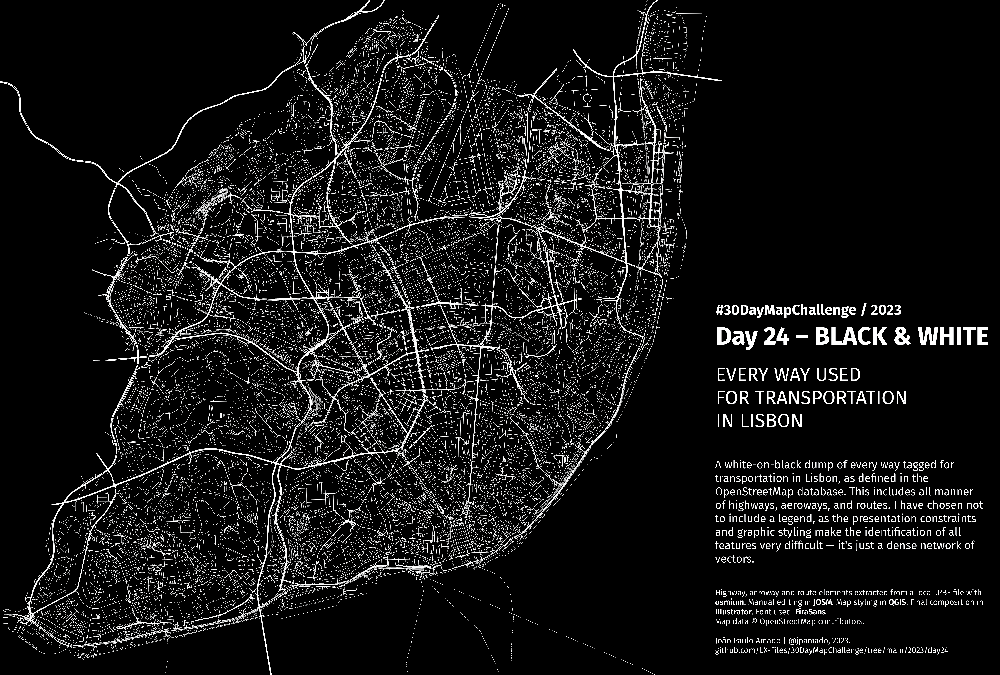

<h1>MAP for day 24 - BLACK & WHITE</h1>
<h2>EVERY WAY USED FOR TRANSPORTATION IN LISBON</h2> 

A white-on-black dump of every way tagged for transportation in Lisbon, as defined in the OpenStreetMap database. This includes all manner of highways, aeroways, and routes. I have chosen not to include a legend, as the presentation constraints and graphic styling make the identification of all features very difficult — it's just a dense network of vectors.

Highway, aeroway and route elements extracted from a local .PBF file with <b>osmium</b>. Manual editing in <b>JOSM</b>. Map styling in <b>QGIS</b>. Image editing in <b>Photoshop</b>. Final composition in <b>Illustrator</b>. Font used: <b>FiraSans</b>.   
Map data &copy; OpenStreetMap contributors.  
 

File listing:

<ul>
  <li><b>30daymapchallenge__2023-day24__black_white.png</b> - the MAP itself.</li>
  </ul>

João Paulo Amado | @jpamado, 2023.

&nbsp;

<table>
<tr>
<td style="border:thin #000">

</td>
</tr>
</table>
