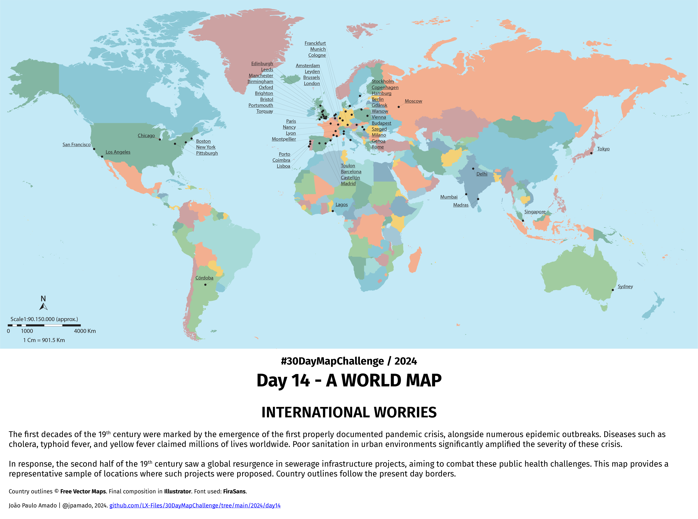

<h1>MAP for day 14 - A WORLD MAP</h1>
<h2>INTERNATIONAL WORRIES</h2>

The first decades of the 19th century were marked by the emergence of the first properly documented pandemic crisis, alongside numerous epidemic outbreaks. Diseases such as cholera, typhoid fever, and yellow fever claimed millions of lives worldwide. Poor sanitation in urban environments significantly amplified the severity of these crisis.

In response, the second half of the 19th century saw a global resurgence in sewerage infrastructure projects, aiming to combat these public health challenges. This map provides a representative sample of locations where such projects were proposed.

Country outlines © <b>Free Vector Maps</b>. Final composition in <b>Illustrator</b>. Font used: <b>FiraSans</b>.

File listing:

<ul>
  <li><b>30daymapchallenge__2024-day14__a_world_map.png</b> - the MAP itself</li>
  <li><b>sources.pdf</b> - a listing of all the sources used in identifying the selected locations</li>
</ul>

João Paulo Amado | @jpamado, 2024.

&nbsp;

<table>
<tr>
<td style="border:thin #000">

</td>
</tr>
</table>
