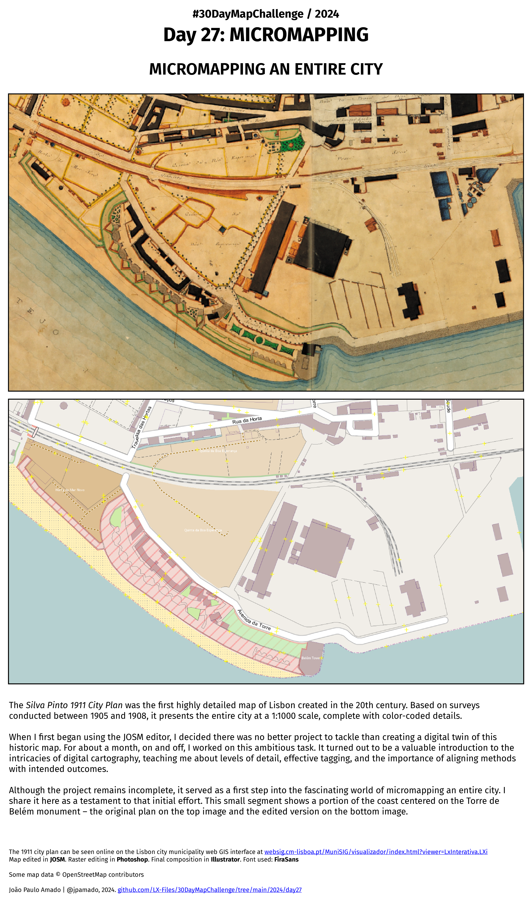

<h1>MAP for day 27: MICROMAPPING</h1>
<h2>MICROMAPPING AN ENTIRE CITY</h2>

The <i>Silva Pinto 1911 City Plan</i> was the first highly detailed map of Lisbon created in the 20th century. Based on surveys conducted between 1904 and 1911, it presents the entire city at a 1:1000 scale, complete with color-coded details.

When I first began using the JOSM editor, I decided there was no better project to tackle than creating a digital twin of this historic map. For about a month, on and off, I worked on this ambitious task. It turned out to be a valuable introduction to the intricacies of digital cartography, teaching me about levels of detail, effective tagging, and the importance of aligning methods with intended outcomes.

Although the project remains incomplete, it served as a first step into the fascinating world of micromapping an entire city. I share it here as a testament to that initial effort. This small segment shows a portion of the coast centered on the Torre de Belém monument.

The 1911 city plan can be seen online on the Lisbon city municipality web GIS interface at <a href="https://websig.cm-lisboa.pt/MuniSIG/visualizador/index.html?viewer=LxInterativa.LXi">websig.cm-lisboa.pt/MuniSIG/visualizador/index.html?viewer=LxInterativa.LXi</a>

Map edited in <b>JOSM</b>. Raster editing in <b>Photoshop</b>. Final composition in <b>Illustrator</b>. Font used: <b>FiraSans</b>.

Some map data © OpenStreetMap contributors 

File listing:

<ul>
  <li><b>30daymapchallenge__2024-day27__micromapping.png</b> - the MAP itself</li>
</ul>

João Paulo Amado | @jpamado, 2024.

&nbsp;

<table>
<tr>
<td style="border:thin #000">

</td>
</tr>
</table>
