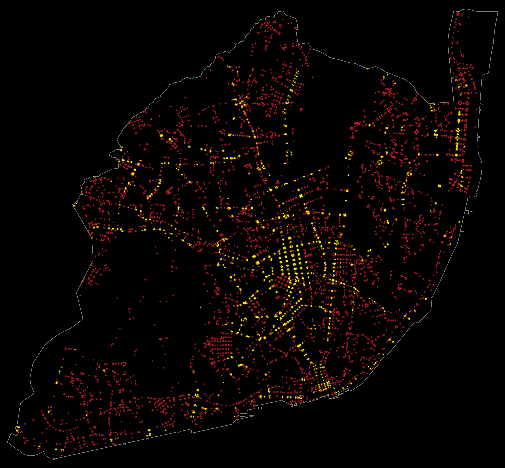

<h1>MAP for day 1 - POINTS</h1>
<h2>CROSSING SAFELY</h2> 

All the locations of traffic lights (yellow) and pedestrian crossings (red) in Lisbon presented as groups of points, extracted from the OpenStreetMap database.

Without further graphic information, these points show the latent structure of the major city streets. The yellow points end up showing where traffic is most intense (motorways excepted).

Points edited in <b>#JOSM</b>. Map styling in <b>#QGIS</b>. Raster editing in <b>#Photoshop</b>. Final composition in <b>#Illustrator</b>. Font used: <b>FiraSans</b>. Map data  © OpenStreetMap contributors.

File listing:

<ul>
<li><b>30daymapchallenge__2025-day01__points.png</b> - the MAP itself.</li>
<li><b>lx_municipality_contour.osm</b> - the contour line for the Lisbon municipality in 2025.</li>
<li><b>lx_municipality_highway_crossing.osm</b> - highway crossings inside Lisbon.</li>
<li><b>lx_municipality_highway_traffic-signals.osm</b> - traffic signals inside Lisbon.</li>
</ul>

João Paulo Amado | @jpamado, 2025.

&nbsp;

<table>
<tr>
<td style="border:thin #000">

</td>
</tr>
</table>
