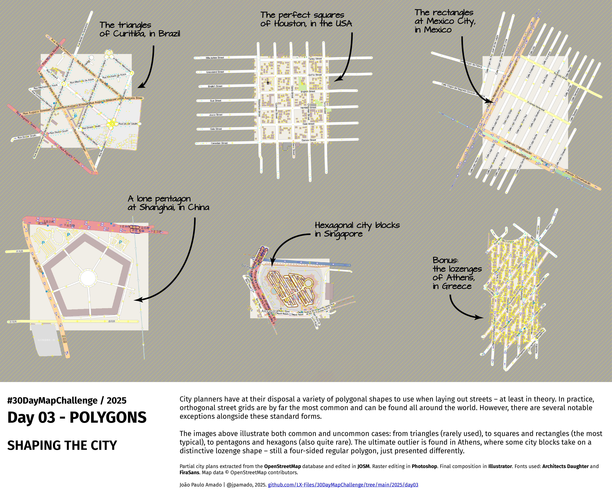

<h1>MAP for day 3 - POLYGONS</h1>
<h2>SHAPING THE CITY</h2> 

City planners have at their disposal a variety of polygonal shapes to use when laying out streets - at least in theory. In practice, orthogonal street grids are by far the most common and can be found all around the world. However, there are several notable exceptions alongside these standard forms.

The images above illustrate both common and uncommon cases: from triangles (rarely used), to squares and rectangles (the most typical), to pentagons and hexagons (also quite rare). The ultimate outlier is found in Athens, where some city blocks take on a distinctive lozenge shape - still a four-sided regular polygon, just presented differently.

Partial city plans extracted from the <b>#OpenStreetMap</b> database and edited in <b>#JOSM</b>. Raster editing in <b>#Photoshop</b>. Final composition in <b>#Illustrator</b>. Fonts used: <b>Architects Daughter</b> and <b>FiraSans</b>. Map data © OpenStreetMap contributors.

File listing:

<ul>
<li><b>30daymapchallenge__2025-day03__polygons.png</b> - the MAP itself.</li>
<li><b>polygons_around_the_world.kml</b> - location of city blocks exemplified in .KML file format for Google Earth.</li>
<li><b>polygons_triangles_curitiba.osm</b> - partial city plan of Curitiba in Brazil, in OpenStreetMap file format.</li>
<li><b>polygons_squares_houston.osm</b> - partial city plan of Houston in the USA, in OpenStreetMap file format.</li>
<li><b>polygons_rectangles_mexico_city.osm</b> - partial city plan of Mexico City in Mexico, in OpenStreetMap file format.</li>
<li><b>polygons_pentagon_shanghai.osm</b> - partial city plan of Shanghai in China, in OpenStreetMap file format.</li>
<li><b>polygons_hexagons_singapore.osm</b> - partial city plan of Singapore, in OpenStreetMap file format.</li>
<li><b>polygons_lozenges_athens.osm</b> - partial city plan of Athens in Greece, in OpenStreetMap file format.</li>
</ul>

João Paulo Amado | @jpamado, 2025.

&nbsp;

<table>
<tr>
<td style="border:thin #000">

</td>
</tr>
</table>
