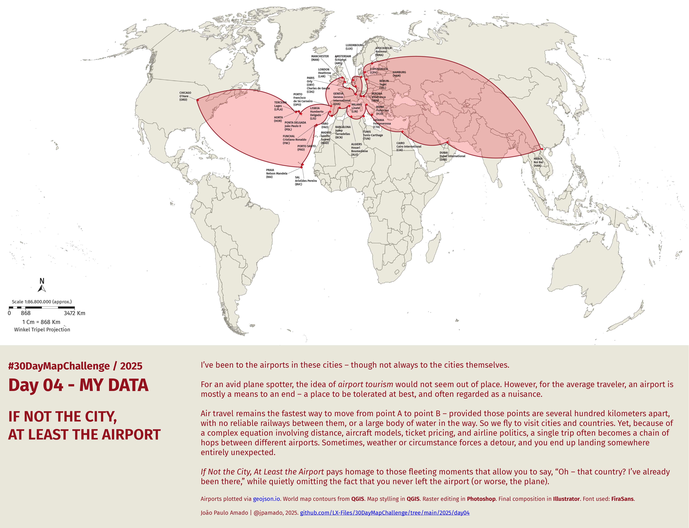

<h1>MAP for day 4 - MY DATA</h1>
<h2>IF NOT THE CITY, AT LEAST THE AIRPORT</h2> 

I’ve been to the airports in these cities - though not always to the cities themselves.

For an avid plane spotter, the idea of <i>airport tourism</i> would not seem out of place. However, for the average traveler, an airport is mostly a means to an end - a place to be tolerated at best, and often regarded as a nuisance.

Air travel remains the fastest way to move from point A to point B - provided those points are several hundred kilometers apart, with no reliable railways between them, or a large body of water in the way. So we fly to visit cities and countries. Yet, because of a complex equation involving distance, aircraft models, ticket pricing, and airline politics, a single trip often becomes a chain of hops between different airports. Sometimes, weather or circumstance forces a detour, and you end up landing somewhere entirely unexpected.

<i>If Not the City, At Least the Airport</i> pays homage to those fleeting moments that allow you to say, “Oh - that country? I’ve already been there,” while quietly omitting the fact that you never left the airport (or worse, the plane).

Airports plotted via <a href="https://geojson.io">geojson.io</a>. World map contours from <b>#QGIS</b>. Map stylling in <b>#QGIS</b>. Raster editing in <b>#Photoshop</b>. Final composition in <b>#Illustrator</b>. Font used: <b>FiraSans</b>.

File listing:

<ul>
<li><b>30daymapchallenge__2025-day04__my-data.png</b> - the MAP itself.</li>
<li><b>if_not_the_city_at_least_the_airport.geojson</b> - location of all the airports in GeoJSON file format.</li>
<li><b>if_not_the_city_at_least_the_airport.kml</b> - plocation of all the airports in KML file format.</li>
</ul>

João Paulo Amado | @jpamado, 2025.

&nbsp;

<table>
<tr>
<td style="border:thin #000">

</td>
</tr>
</table>
