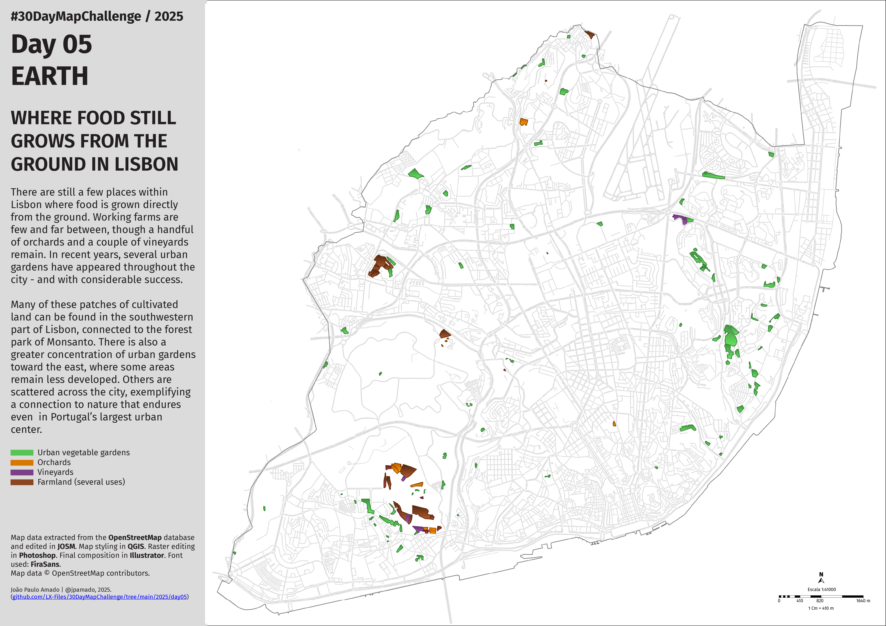

<h1>MAP for day 5 - EARTH</h1>
<h2>WHERE FOOD STILL GROWS FROM THE GROUND IN LISBON</h2> 

There are still a few places within Lisbon where food is grown directly from the ground. Working farms are few and far between, though a handful of orchards and a couple of vineyards remain. In recent years, several urban gardens have appeared throughout the city - and with considerable success.

Many of these patches of cultivated land can be found in the southwestern part of Lisbon, connected to the forest park of Monsanto. There is also a greater concentration of urban gardens toward the east, where some areas remain less developed. Others are scattered across the city, exemplifying a connection to nature that endures even  in Portugal’s largest urban center.

Map data extracted from the <b>#OpenStreetMap</b> database and edited in <b>#JOSM</b>. Map styling in <b>#QGIS</b>. Raster editing in <b>#Photoshop</b>. Final composition in <b>#Illustrator</b>. Font used: <b>#FiraSans</b>. Map data © OpenStreetMap contributors.   

File listing:

<ul>
<li><b>30daymapchallenge__2025-day05__earth.png</b> - the MAP itself.</li>
<li><b>Urban_vegetable_gardens.osm</b> - location of the Lisbon urban vegetable gardens in the OpenStreetMap database.</li>
<li><b>Orchards.osm</b> - location of the Lisbon orchards in the OpenStreetMap database.</li>
<li><b>Vineyards.osm</b> - location of the Lisbon vineyards in the OpenStreetMap database.</li>
<li><b>Farmland.osm</b> - location of farmland in Lisbon in the OpenStreetMap database.</li>
</ul>

João Paulo Amado | @jpamado, 2025.

&nbsp;

<table>
<tr>
<td style="border:thin #000">

</td>
</tr>
</table>
