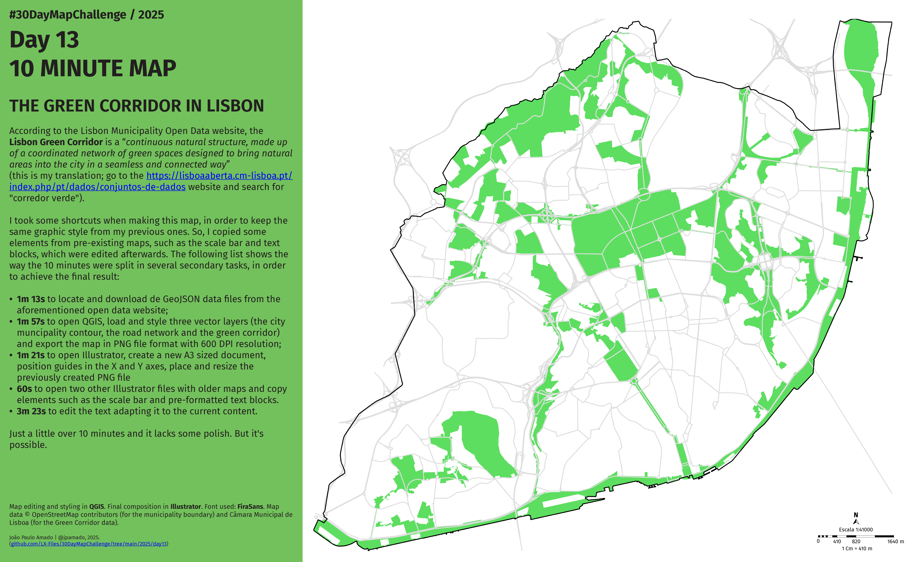

<h1>MAP for day 13 - 10 MINUTE MAP</h1>
<h2>THE GREEN CORRIDOR IN LISBON</h2> 

According to the Lisbon Municipality Open Data website, the Lisbon Green Corridor is defined as a “continuous natural structure made up of a coordinated network of green spaces designed to bring natural areas into the city in a seamless and connected way.” (This is my translation; you can find the original description on the website https://lisboaaberta.cm-lisboa.pt/index.php/pt/dados/conjuntos-de-dados by searching for “corredor verde.”)

I took a few shortcuts when making this map in order to maintain the same graphic style as my previous ones. I reused some elements from earlier maps—such as the scale bar and text blocks—and edited them afterward. The list below shows how the 10 minutes were broken down into smaller tasks to achieve the final result:

<ul>
<li><b>1m 13s</b> to locate and download the GeoJSON data files from the aforementioned open data website;</li>
<li><b>1m 57s</b> to open QGIS, load and style three vector layers (the municipal boundary, the road network, and the green corridor), and export the map as a 600 DPI PNG file;</li>
<li><b>1m 21s</b> to open Illustrator, create a new A3 document, set up guides on both axes, place the PNG, and resize it;</li>
<li><b>60s</b> to open two other Illustrator files containing older maps and copy elements such as the scale bar and preformatted text blocks;</li>
<li><b>3m 23s</b> to edit the text and adapt it to the new content.</li>
</ul>

A bit over 10 minutes — and it still needs some polish. But it’s doable.

Map editing and styling in <b>QGIS</b>. Final composition in <b>Illustrator</b>. Font used: <b>FiraSans</b>. Map data © OpenStreetMap contributors (for the municipality contour) and Câmara Municipal de Lisboa (for the Green Corridor data).
    

File listing:

<ul>
<li><b>30daymapchallenge__2025-day-13__10-minute-map.png</b> - the MAP itself.</li>
</ul>

João Paulo Amado | @jpamado, 2025.

&nbsp;

<table>
<tr>
<td style="border:thin #000">

</td>
</tr>
</table>
