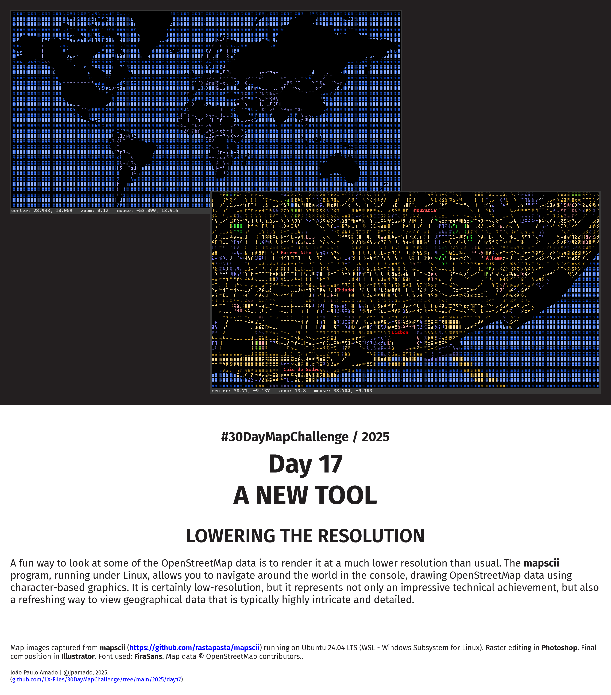

<h1>MAP for day 17 - A NEW TOOL</h1>
<h2>LOWERING THE RESOLUTION</h2> 

A fun way to look at some of the OpenStreetMap data is to render it at a much lower resolution than usual. The mapscii program, running under Linux, allows you to navigate around the world in the console, drawing OpenStreetMap data using character-based graphics. It is certainly low-resolution, but it represents not only an impressive technical achievement, but also a refreshing way to view geographical data that is typically highly intricate and detailed.

Map images captured from <a href="https://github.com/rastapasta/mapscii"><b>mapscii</b></a> running on Ubuntu 24.04 LTS (WSL - Windows Subsystem for Linux). Raster editing in <b>Photoshop</b>. Final composition in <b>Illustrator</b>. Font used: <b>FiraSans</b>. Map data © OpenStreetMap contributors.
    

File listing:

<ul>
<li><b>30daymapchallenge__2025-day-17__a_new_tool.png</b> - the MAP itself.</li>
</ul>

João Paulo Amado | @jpamado, 2025.

&nbsp;

<table>
<tr>
<td style="border:thin #000">

</td>
</tr>
</table>
